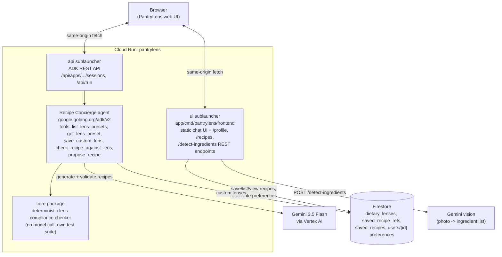

# PantryLens

Turn the ingredients in your kitchen into recipes that fit your dietary
rules — combine any number of "lenses" (allergen, macro, or health-condition
constraints), refine recipes conversationally, and every candidate is
checked by a deterministic Go function before it's ever shown to you.

**Track:** Collaborative Partner · **Live demo:**
https://pantrylens-765410575676.us-central1.run.app

## Architecture



`core` is the trust boundary: it's a dependency-free Go package (own module,
`pantrylens/core`) holding the dietary-lens model and
`CheckRecipeAgainstLens`, a deterministic function, not another model call.
Every candidate recipe the agent drafts has to pass this check before
`propose_recipe` renders it as a card — the system doesn't rely on the model
getting dietary safety right on its own. `app` (module `pantrylens/app`)
is everything that talks to Google APIs: the ADK agent and tool wiring,
Gemini/Vertex AI, Firestore, and the web UI.

## What it does

- **Combine any number of dietary lenses at once** — 13 built-in presets
  (GERD-Friendly, Hormonal Balance, Macro Target, Athletic Performance,
  Vegetarian, Vegan, Diabetic-Friendly, Heart-Healthy, Gluten-Free,
  Dairy-Free, Keto, Low-FODMAP, Kidney-Friendly), or describe your own goals
  in plain language and the agent saves it as a reusable custom lens. Active
  lenses combine (e.g. Vegetarian + GERD-Friendly + a custom "no cilantro"
  rule) — `Registry.CombineLenses` merges every active lens's avoid/prefer
  lists, macro targets, and rules into one set a recipe must satisfy
  simultaneously, not just whichever lens happened to get checked.
- **Add ingredients by typing, pasting a list, or a photo** — photo-based
  detection runs a one-shot Gemini vision call constrained to a JSON
  ingredient-list schema.
- **Ask for one meal or a whole week of meal prep** — meal-prep requests
  (via the intake form's toggle, or just asked for in chat) get a full
  batch of recipes that deliberately share ingredients with each other,
  each with a storage/reheat note, and a "Save all" action.
  You choose the meal type (breakfast/lunch/dinner/snack) — the agent
  never assumes dinner.
- **Refine conversationally** — "more protein," "no dairy," "use up the
  spinach" all work as follow-ups; a session survives a page refresh
  (resumed from ADK's own session history, no separate persistence layer).
- **Save recipes, filterable by meal type** — each recipe gets its own
  shareable page; "My saved recipes" groups meal-prep batches together and
  filters by Breakfast/Lunch/Dinner/Snack.

## Quickstart (local)

Requires Go 1.26+ and a GCP project with billing enabled (Vertex AI, not a
plain AI Studio key, so usage draws against GCP credit).

```bash
gcloud auth application-default login
gcloud config set project YOUR_PROJECT_ID
gcloud services enable aiplatform.googleapis.com firestore.googleapis.com run.googleapis.com

export GOOGLE_GENAI_USE_ENTERPRISE=1
export GOOGLE_CLOUD_PROJECT=your-real-project-id
export GOOGLE_CLOUD_LOCATION=global   # must be "global", not a region -- see note below

cd app
go mod tidy
go build ./... && go vet ./...

cd cmd/pantrylens
go run . web -write-timeout=180s -read-timeout=180s ui api
# open http://localhost:8080
```

`go run . console` also works, for a terminal-only chat without the web UI.

**`GOOGLE_CLOUD_LOCATION` must be `global`, not a region** — confirmed live,
`gemini-3.5-flash` 404s as a Vertex publisher model on regional endpoints
(e.g. `us-central1`) but resolves on `global`. This only affects where the
Gemini client sends requests; Firestore resolves its own location from the
database itself.

**`-write-timeout`/`-read-timeout` matter** — ADK's 15s default is too
short for a multi-recipe turn (draft → `check_recipe_against_lens` →
`propose_recipe` per candidate routinely takes 20–40s, longer for a
meal-prep batch); at the default, the connection is killed right as the
response is ready.

Firestore is optional for local dev: if it's unset or unreachable, lenses,
preferences, and saved recipes fall back to in-memory automatically (see
"Firestore-backed storage" below) and everything else still works.

## Run the core tests (no GCP setup needed)

```bash
cd core
go test ./... -v
```

`core` imports nothing but the Go standard library (`core/firestore_store.go`
is the one opt-in exception, only pulled in via `core.NewFirestoreRegistry`
etc.) — `gofmt`, `go vet`, and `go test` all run clean with zero setup.

## Firestore-backed storage

By default the agent uses in-memory stores for custom lenses, saved
recipes, and per-user preferences (last servings/cuisine) — fine for a demo,
lost on restart. Set `GOOGLE_CLOUD_PROJECT` and the app switches to
Firestore-backed implementations instead (`core.NewFirestoreRegistry`,
`app.NewRecipeStore`, `app.NewPreferenceStore`) so all of it survives a
restart or a Cloud Run cold start. If Firestore construction fails for any
reason (auth, network), each store logs a warning and falls back to
in-memory rather than failing to start. Built-in lens presets always work
either way — they come from `BuiltInLenses()`, not the store.

## Saving and viewing a recipe

Every recipe card has a "Save recipe" button. Clicking it `POST`s the
card's full details to `/recipes` (see
`app/cmd/pantrylens/frontend/frontend.go` and `recipe_view.go`), which mints
a random ID, persists it via `core.RecipeStore`, and shows an inline
confirmation with a link to `/recipes/{id}` — a standalone page reusing the
same `.recipe-card` styling as the in-chat card. Saving never navigates
anywhere on its own; opening the saved page is always an explicit click.

## PantryLens's own web UI

ADK's built-in `webui` sublauncher is a developer console (Events/Traces/
State/Artifacts panels) — useful for debugging, not something to show a
user as "the product." `app/cmd/pantrylens/frontend` is a small,
self-contained chat frontend (plain HTML/CSS/JS, no build step) registered
as its own `ui` sublauncher instead, serving at `/` and talking to ADK's
REST API at same-origin `/api/...`. Being same-origin means no CORS/public-
URL configuration is needed — a real advantage over `webui`, whose
browser-side JS defaults to calling back to `http://localhost:8080/api`,
which only works when server and browser share a machine.

## Deploy to Cloud Run

The `web` launcher already binds `:8080` on all interfaces by default,
matching what Cloud Run expects — no code changes needed beyond what's
already in the `Dockerfile`:

```bash
gcloud run deploy pantrylens --source . --region us-central1 \
  --set-env-vars GOOGLE_CLOUD_PROJECT=your-project-id,GOOGLE_CLOUD_LOCATION=global,GOOGLE_GENAI_USE_ENTERPRISE=1 \
  --allow-unauthenticated

gcloud projects add-iam-policy-binding your-project-id \
  --member="serviceAccount:<cloud-run-service-account>" --role="roles/aiplatform.user"
gcloud projects add-iam-policy-binding your-project-id \
  --member="serviceAccount:<cloud-run-service-account>" --role="roles/datastore.user"
```

Demo the whole ingredients → lens → recipe → save loop through the deployed
URL; nothing in it needs local-only credentials.

## A known simplification, called out on purpose

`core.CheckRecipeAgainstLens`'s `mentions()` helper matches on literal
words/token overlap, not food-category knowledge — an avoid-rule for
`"citrus"` won't infer that `"orange juice"` is a citrus product. That would
need a synonym/category table or a second model call, scoped out
deliberately. The agent's own instructions are the first line of defense on
category-level judgment; the deterministic checker is a safety net on top
of that, not a substitute for it.

A saved recipe's link is unguessable (a random 128-bit ID) but not
access-controlled or expiring — anyone with the link can view it, forever.
Fine for a demo; a production version would add expiry and/or scope links
to the user who saved them.
